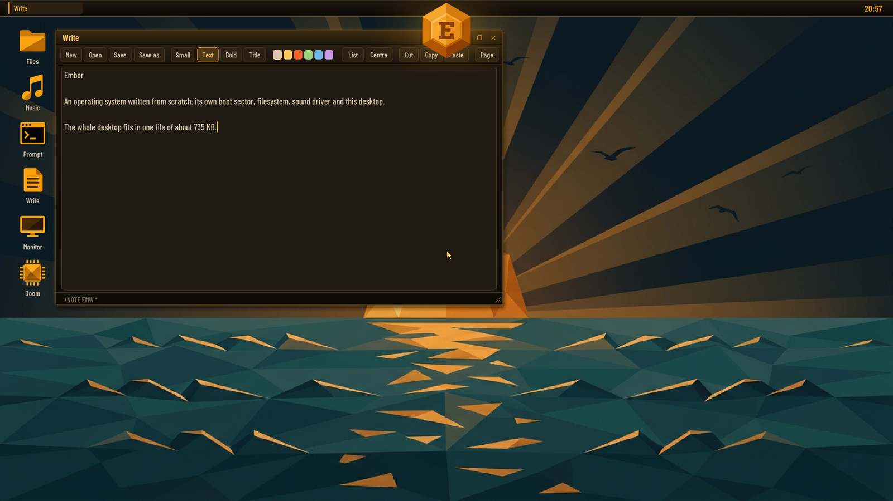
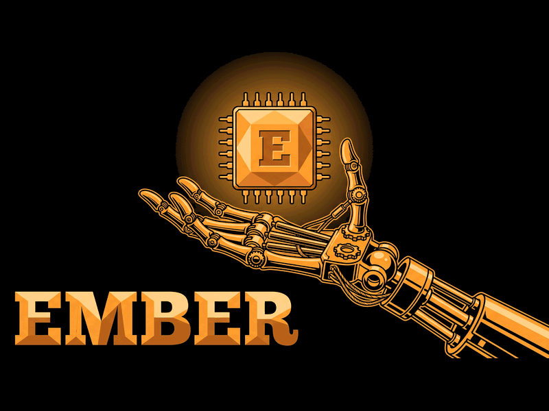
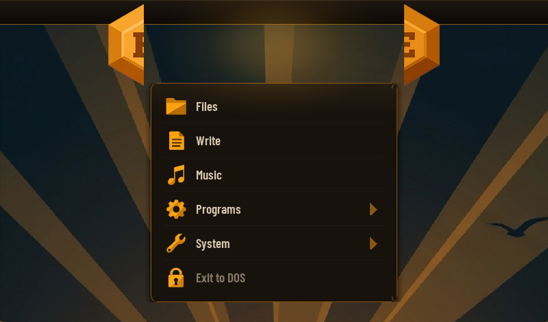
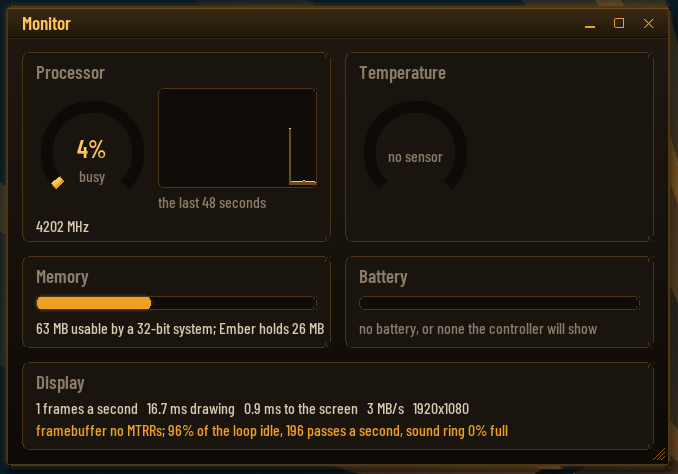
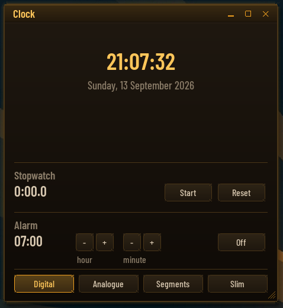
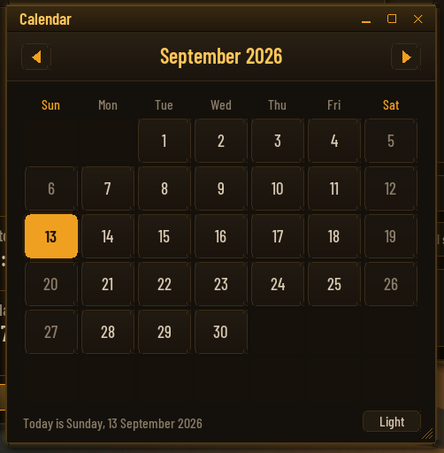
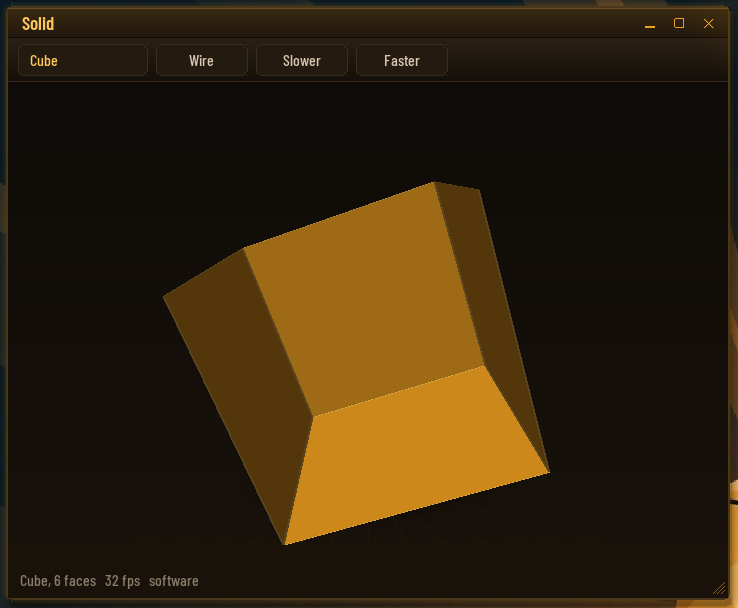
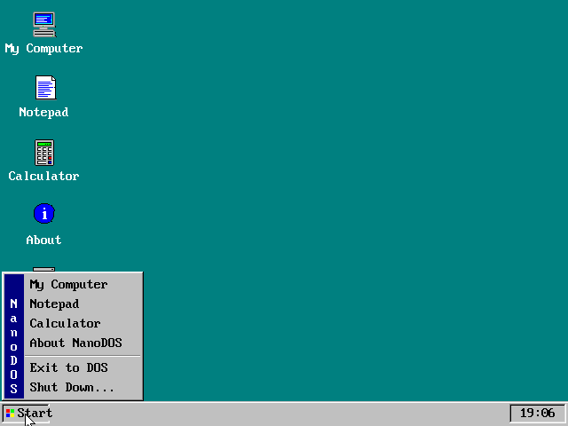
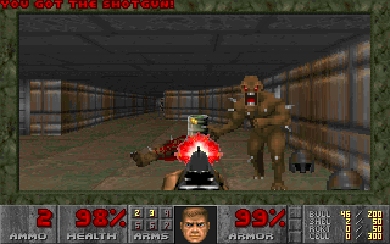
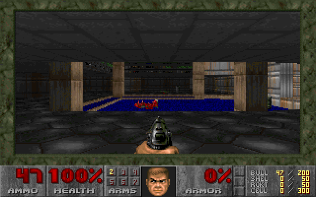

# Ember

An operating system written from scratch: its own boot sector, FAT
filesystem, DOS-compatible interrupts, sound driver, 32-bit runtime and
graphical desktop. It boots from a USB stick on a real laptop, runs real DOS
programs (with Sound Blaster sound, on a machine that has no Sound Blaster),
and gives you a desktop with a music player, a word
processor, a paint program, touch input and 3D graphics. Nothing is borrowed
from Linux, Windows or FreeDOS.

The code was written by Claude (Anthropic) through Claude Code. Every
feature was asked for, every design directed and every build booted and
tested on real hardware by a person, who sent back what broke.



| Boot splash | The crystal, broken open |
|---|---|
|  |  |

Underneath is a 16-bit kernel in NASM assembly (`src/`, about 46 KB), a
DOS-compatible `INT 21h`, and a 32-bit runtime (`nano/`) that loads flat
protected-mode programs above 1 MB and lends them the BIOS. The whole
desktop, every application included, is one 32-bit program: `EMBER.N32`,
about 735 KB.

Everything is here: the assembly kernel, the C programs, a Python build
script that assembles a bootable image, and a QEMU harness that types keys,
drives the mouse, captures audio and takes screenshots.

## At a glance

- **Boots two ways.** A legacy BIOS / CSM boot from an MBR, and **Ember 2.0**
  for laptops that boot only UEFI: a UEFI application with a small BIOS of
  its own underneath the same, unchanged kernel (`ember2/`).
- **Runs DOS software.** `.COM` and `.EXE` programs, batch files, XMS
  extended memory, and a DPMI host that DOS/4GW games run under.
- **A Sound Blaster that is not there.** Real-mode games get one from a
  virtual-8086 monitor (`LOAD SB`); DOS/4GW games such as Doom and Hexen get
  one from the DPMI host (`LOAD DPMI`). Digital sound and FM music both
  come out of the laptop's HD Audio chip, the music from a software OPL3.
- **The PC speaker, heard on a laptop that has none**, so games like Alley
  Cat have their sound.
- **A desktop of its own** (`EMBER`): true colour, anti-aliased type, a
  crystal for a start menu, and applications (see below).
- **Real drivers where the BIOS has none**: HD Audio, the touchpad and
  touchscreen on the I²C bus, and the Intel graphics chip for scan-out and
  3D.
- **Doom, twice**: the original `DOOM.EXE` under DOS/4GW with Sound Blaster
  sound, and NDOOM, id's source compiled for Ember with sound effects and
  OPL music.

## The desktop (`EMBER`)

Type `EMBER` at the prompt. The desktop picks the largest true-colour mode
no bigger than 1920x1200 (or the panel's own mode, if the firmware offers
nothing else, drawn at half size and doubled when the panel is very large).
The start menu is an ember crystal at the top of the screen: click it and it
breaks in half, the pieces slide apart, and the menu falls out of the gap.
Exit to DOS returns to the prompt.

| Monitor | Clock |
|---|---|
|  |  |
| **Calendar** | **3D** |
|  |  |

- **Files**: a file manager; opens pictures, music and text, runs programs.
- **Write**: a word processor with styles (small, text, bold, title, lists,
  centred), cut and paste, page view, four colour themes, and a file picker
  for Open and Save as.
- **Music**: MP3 and WAV (long file names too) with a spectrum analyser.
- **Paint**: made for fingers, eight brushes, undo, saved as PNG.
- **Pictures**, **Calculator**, **Clock** (digital, analogue, segments),
  **Calendar**, **Notes**, a **Prompt**, **Screenshot** (also F12 or
  Print Screen, saved as PNG), **3D** (a spinning scene, drawn in software
  or by the graphics chip), and **Doom**.
- **System**: **Monitor** (the processor, where each frame's time goes, the
  framebuffer's memory type), an **on-screen keyboard**, desktop **icons**,
  **Help** and **About**.
- The background is one of five drawn washes or a JPEG or BMP off the disk
  (right-click the desktop). The desktop remembers the background, the icons
  and where each window was, in `EMBER.CFG`.

Hardware it talks to directly:

- **Touchpad and touchscreen.** On the Yoga 3 Pro both are HID devices on
  I²C controllers the firmware does not list and leaves asleep; the desktop
  wakes them and reads the pad (Synaptics, 0x2C) and the screen (Atmel,
  0x4A) itself. Taps, clicks, dragging, and the screen works as a tablet
  with the on-screen keyboard.
- **The framebuffer's memory type.** The firmware marks it uncacheable, so
  every pixel crossed the bus on its own. The desktop rewrites the CPU's
  memory-type ranges to make it write-combining, and restores them on exit.
- **The Intel graphics chip** (Broadwell, HD 5300). The desktop scans out
  from buffers of its own in the chip's page table, flips between two of
  them at the vertical blank so nothing tears, draws the pointer with the
  hardware cursor, and offers the 3D engine as a service. On any other
  graphics hardware this path declines and frames are copied instead.

32-bit programs beside the desktop: `FLY.N32` flies through a tunnel drawn
by the 3D engine, `VOXEL.N32` is a block world, `RENDER.N32` and `GPU.N32`
are the probes that found out how the chip works (`docs/HARDWARE.md`).

## Features

**Kernel / DOS side**
- 512-byte FAT boot sector that loads the kernel with INT 13h LBA reads
  (USB and hard disks) and falls back to CHS (floppies, old BIOSes).
- FAT12 and FAT16 driver: subdirectories, cluster chains, paths such as
  `\DOCS\FILE.TXT`, `..`, free-space accounting, and writing: files can be
  created, extended and deleted, with every change to the allocation table
  written through to both copies immediately. Volumes up to 2 GB (the FAT16
  limit), with the cluster size chosen to suit.
- Long file names, the way Windows put them on a FAT disk: the extra
  directory entries are read, checked against their short name and shown
  by `DIR`, the file managers and the desktop. Names can be typed too, in
  quotes when they contain spaces: `TYPE "Release Notes.txt"`,
  `CD "My Documents"`. DOS programs are unaffected: they still see the 8.3
  name (`RELEAS~1.TXT`), which is what they expect.
- Command shell: `DIR`, `CD`, `TYPE`, `COPY`, `DEL`, `REN`, `MKDIR`,
  `RMDIR`, `ECHO`, `CLS`, `COLOR`, `TIME`, `DATE`, `MEM`, `VER`, `BEEP`,
  `PLAY`, `SOUND`, `SPEAKER`, `SPLASH`, `LOAD`, `UNLOAD`, `TRACE`, `PAUSE`,
  `REM`, `REBOOT`, `SHUTDOWN` (APM power-off), `WIN`, plus batch files
  (`AUTOEXEC.BAT` runs at boot). `DIR` pages and matches wildcards. Tab
  completes file and directory names at the prompt: one match is filled in,
  several are extended as far as they agree and then listed.
- A real DOS program environment: `.COM` and `.EXE` (MZ, with relocations)
  loading, DOS-style memory blocks (MCBs) with allocate/resize/free, PSPs
  with environment blocks and command tails, nested `EXEC` (a program can
  run another and get its exit code), and the `INT 21h` calls programs use:
  console I/O, files (open/read/seek/close, FindFirst/FindNext, attributes,
  IOCTL), directories (make, remove, rename/move), date/time, vectors,
  version. `INT 21h` runs on its own kernel stack, as DOS does.
- Resident modules: the kernel fits in one 64 KB segment and that segment
  is full, so a driver that stays resident lives in the high memory area,
  the 64 KB above the megabyte, where it costs DOS programs nothing.
  `LOAD name` reads `NAME.MOD` (from the current directory or the root)
  into its slot there (or into conventional memory if the slot cannot be
  had), calls its init, and keeps it; `UNLOAD name` takes it out again,
  and `LOAD` alone lists what is loaded. A module is a flat binary with a
  32-byte header naming its init, unload and event entries; the kernel tells
  every module when the shell is back at its prompt and when a program
  starts or ends, and hands each a table of services (printing, memory, the
  log) to far-call. The format is in `modules/ember.inc`.
- `XMS.MOD`: extended memory for DOS programs, XMS 3.0 as HIMEM.SYS answers
  it, with the pool taken from the upper half of extended memory so it
  never meets the 32-bit programs loaded at 1 MB. `AUTOEXEC.BAT` loads it at
  boot; hold Shift to boot without it. `XMSTEST.COM` checks it.
- `DPMI.MOD`: a DPMI 0.9 host for 32-bit clients: descriptors, extended and
  DOS memory, real-mode calls and callbacks, exception handlers, hooked
  hardware interrupts, all checked by `DPMITEST.COM`. DOS/4GW runs under it,
  and it carries the Sound Blaster for DOS/4GW games. It is not loaded by
  default: `LOAD DPMI`. `docs/DPMI-STATUS.md` is the story of getting there.
- A two-panel file manager for the prompt: `FM`. Tab switches panels, Enter
  opens a directory or runs a program, F5 copies, F6 renames or moves, F7
  makes a directory, F8 deletes, F3 views, F1 is help. Enter on an `.MP3`
  or `.WAV` opens the music player. It is a plain `.COM` program
  (`programs/fm.asm`), so it can run other programs and get them back.
- A boot splash: `SPLASH picture.bin [music.wav]` shows a full-screen
  800x600 picture, plays a WAV under it, and holds it for a key or three
  seconds. `tools/mksplash.py image.jpg` makes the file from any picture;
  `AUTOEXEC.BAT` shows `SPLASH.BIN` with the chime at every boot.
- A music player for the prompt: `PLAYER` (or `PLAYER dir`,
  `PLAYER file.mp3`), 640x480, built from `nano/player/` with the
  public-domain minimp3 decoder.

**Sound**
- `PLAY file.wav` streams PCM WAV files (8/16-bit, mono/stereo, 8-48 kHz)
  through the Intel HD Audio controller with a driver written for real mode
  (PCI probe, unreal-mode MMIO, CORB/RIRB codec commands, DMA ring buffer);
  `PLAY C E G > C` plays note strings.
- The driver probes every controller on the PCI bus (laptops usually have
  two: HDMI audio on the graphics chip and the chipset one that drives the
  speakers), picks the codec's speaker (or headphone / line-out) pin,
  follows its connection list to a DAC, and upsamples in software when the
  codec rejects the file's sample rate. `SOUND` shows what was found and
  `SOUND DEBUG` prints every command and response of the probe.
- **The PC speaker**, on machines that do not have one: `SPEAKER ON` arms
  the processor's hardware I/O breakpoints on the timer and speaker ports,
  so every note a program writes arrives as a debug trap and is played as a
  square wave through HD Audio. Nothing runs periodically and the timer is
  never read, so a game that uses it for its own timing is undisturbed.
  `SPEAKER OFF` hands the clock interrupt and the debug registers back.
  `LOAD SB` has since replaced it for real-mode games: its monitor catches
  the speaker's ports the same way it catches the card's, before the
  instruction rather than after, and leaves the debug registers free.
  `SPEAKER ON` is still there for when the monitor is not loaded.
- **A Sound Blaster** (`docs/SOUND-BLASTER.md`). The card answers at 220h,
  IRQ 5, DMA 1, and `BLASTER=A220 I5 D1 T3` is put in a program's
  environment. Two hosts provide it:
  - `LOAD SB` for **real-mode games**. `SB.MOD` runs DOS and the program in
    virtual-8086 mode under a port permission map, so a read or write to the
    card faults *before* it happens and the monitor answers as the card
    would: the DSP handshake, the 8237 transfer controller, the card's own
    interrupt, raised when a block has played. The speaker is handled the
    same way while it is loaded.
  - `LOAD DPMI` for **DOS/4GW games** (Doom, Hexen). A protected-mode client
    needs IOPL 3, where the permission map is never consulted, so the host
    watches the card's ports with the debug registers instead, reads the
    game's buffer address back out of the real transfer controller, and
    tells the game how far the card has got.
  - FM music goes to `nano/opl/opl3.c`, a complete OPL3 in software (the
    YMF262, eighteen voices, four-operator mode, percussion, in the
    logarithmic domain the chip uses), mixed into the same stream as the
    digital sound.

**The original graphical shell (`WIN`)**

The first desktop, from before Ember was Ember, still ships inside the
kernel: VESA 800x600x256 by default (`WIN 1024`, `WIN 640`, `WIN LOW`), a
taskbar with a Start button, overlapping windows in a Windows 95 look, its
own PS/2 mouse driver and full keyboard control (`Ctrl+Esc` Start, `Esc`
close, `Tab` switch, `F1` About), with a file browser, Notepad and a
calculator.



## Building

Requirements: Python 3 and NASM. A copy of NASM 3.02 for Windows is bundled
in `tools/nasm/`; on Linux/macOS install `nasm` from your package manager.
The 32-bit programs, the OPL3 and Ember 2.0's UEFI application also need
[Zig](https://ziglang.org), for its bundled clang and linker
(`winget install zig.zig`).

```bash
python build.py
```

This assembles the boot sector, kernel, modules and programs and writes
`build/ember.img`: a 32 MB image with an MBR partition table and one FAT16
partition, ready for a USB stick. Everything in `root/` is copied into it,
so a song dropped into `root/MUSIC` is on the next image. `--size 512` (or
`--size 2048`, the FAT16 maximum) makes it bigger; the image is written
sparsely, so a 2 GB image builds in a couple of seconds. `--floppy` builds a
1.44 MB superfloppy image instead.

The 32-bit programs are built by `tools/build_doom.py` and picked up from
`root/` by `build.py`: with no option it builds NDOOM (from id's
linuxdoom-1.10 source, unpacked into `build/src_dl/DOOM-master`), `--gui`
builds `EMBER.N32`, and `--player`,
`--fly`, `--voxel`, `--render`, `--gpu` and `--hello` build the others.

## Running in QEMU

```bash
python build.py --run
```

boots the image as a hard disk, which is how a USB stick looks to the BIOS,
but without a sound card. For sound, start QEMU with an HD Audio device:

```bash
qemu-system-i386 -m 64 -rtc base=localtime -drive file=build/ember.img,format=raw,if=ide -audiodev dsound,id=snd0 -device intel-hda -device hda-output,audiodev=snd0
```

(`dsound` is Windows; use `pa`, `pipewire` or `coreaudio` elsewhere.) The
image is a plain raw disk image; VirtualBox and VMware need it converted.

## Booting a real PC from a USB stick

### Legacy BIOS / CSM

1. Write `build/ember.img` to the stick **as a raw image** (this erases the
   stick):
   - Windows: [Rufus](https://rufus.ie) → select the `.img`, mode
     "DD Image"; or balenaEtcher; or Win32DiskImager.
   - Linux/macOS: `sudo dd if=build/ember.img of=/dev/sdX bs=1M`
     (double-check the device name).
2. In the PC's firmware setup enable **Legacy Boot / CSM** and disable
   **Secure Boot**.
3. Open the boot menu (usually `F12`, `F11`, `F8` or `Esc` during power-on)
   and pick the USB stick; if it is listed twice, choose the entry *without*
   "UEFI" in front of it.

The stick stays a normal FAT volume: plug it back into Windows and copy
programs, music or pictures onto it. The kernel lives in reserved sectors
that the filesystem never touches.

The boot shows the splash with its chime and stops at the prompt, where
`EMBER` starts the desktop, `FM` the file manager, and `DOOM` the game.
**Hold Shift while it says "Starting Ember"** to skip `AUTOEXEC.BAT`.

### UEFI only: Ember 2.0

Most laptops made since about 2020 cannot boot a BIOS-style OS at all.
Ember 2.0 is a UEFI application (`ember2/stub.c`) that reads `EMBER.IMG`
into memory, leaves boot services, and hands over to a BIOS of its own
(`ember2/shim.asm`): it drops the processor from long mode to real mode and
answers `INT 13h` from the copy in memory, `INT 10h` onto the firmware's
framebuffer (which sits above 4 GB, through a paging window), `INT 16h`
from the keyboard controller and the VESA calls with the panel's own mode.
The kernel runs unchanged and never finds out.

```bash
python build.py
python tools/build_ember2.py
```

Copy the contents of `build/ember2` onto a FAT32 stick (`EFI\BOOT\BOOTX64.EFI`
and `EMBER.IMG`) and pick it from the firmware's one-time boot menu. Secure
Boot has to be off, since nothing is signed; on a machine with BitLocker,
turning it off asks for the recovery key, so ask whoever owns the machine
first. `tools/ember2_test.py` boots it under EDK II in QEMU.

It boots to the prompt and runs the desktop on a Dell with a 3072x1920
panel. What it does not do yet is in `ember2/README.md`: the disk is a copy
in memory (writes last until power-off), DOS games that draw into VGA
memory get no picture on laptops without a VGA core, and the Sound Blaster
monitor cannot run under the shim. `uefi/probe.c` is a UEFI program that
reports whether a machine has what Ember needs, into `EMBRPROB.TXT`.

### Tested on

A **Lenovo Yoga 3 Pro** (Broadwell Core M, 3200x1800 touchscreen, legacy
boot): the desktop, touchpad, touchscreen, HD Audio, the graphics chip's
scan-out and 3D engine, Doom and Hexen with Sound Blaster sound, Alley Cat
and Prince of Persia. And a **Dell** that boots only UEFI, under Ember 2.0.
What the hardware said along the way is in `docs/HARDWARE.md`.

**The boot log:** the image carries a 16 KB `EMBER.LOG` that the kernel
overwrites in place with a log of the boot (video mode, mouse detection, the
complete sound-driver trace, what a Sound Blaster game did). After a boot on
a real PC, plug the stick back into Windows and read exactly what the
hardware said. `tools/readfile.py build/ember.img EMBER.LOG` reads it out of
an image after a QEMU run.

## Running DOS programs, including Doom



Copy DOS programs onto the stick and type their name; `.COM`, `.EXE`,
`.BAT` and `.N32` are found in that order.

Most real-mode DOS software runs: `.COM` files, `MZ` executables with
relocations, text mode and VGA graphics, command-line arguments, and
programs that launch other programs. For sound:

| The game uses | Type first | Then |
|---|---|---|
| the PC speaker (Alley Cat, Prince of Persia) | `LOAD SB` | run it |
| a Sound Blaster, real mode | `LOAD SB` | set it up for Sound Blaster, 220h, IRQ 5, DMA 1 |
| a Sound Blaster, DOS/4GW (Doom, Hexen) | `LOAD DPMI` | the same, in the game's `SETUP` |

DOS/4GW games also run without `LOAD DPMI`, using DOS/4GW's own raw mode,
but then there is no card to hear.

The shareware Doom (`DOOM.EXE`, `DOOM1.WAD`) goes in `root/DOOM/`; the
image ships with a `DOOM.BAT` at the root, so typing `DOOM` starts the
native port and returns to the prompt when you quit. Retail Doom, Doom II
and Hexen work the same way: put the game in a folder on the stick. Game
files are not part of this repository.

### NDOOM: Doom compiled for Ember



`root/DOOM/NDOOM.N32` is id Software's GPL Doom source (linuxdoom-1.10)
built for Ember's 32-bit program format. Its platform layer (`nano/doom/`)
draws through VGA mode 13h, reads the keyboard from the IRQ 1 handler,
times the game with a 140 Hz timer interrupt, mixes the sound effects into a
44.1 kHz stereo stream on the HD Audio driver, and plays the music by
turning the WAD's MUS scores and GENMIDI bank into register writes for the
software OPL3. Saved games work, and the settings you change in the menus
are kept in `NDOOM.CFG`. `-warp 1 1` starts a level directly; `-skill 1..5`
picks the difficulty.

The 32-bit runtime (`src/pm32.asm`) loads an `.N32` file above 1 MB,
switches to protected mode and hands the program a flat 4 GB address space.
Timer and keyboard interrupts are delivered to handlers the program
registers, and `INT 80h` asks the kernel to run any real-mode interrupt
(BIOS or DOS) with a given register set, which is how the C library in
`nano/` does file I/O, console output and video-mode changes.

Programs get about 522 KB of conventional memory, plus all extended memory
for 32-bit programs, which are loaded at 1 MB + 64 KB (the 64 KB below is
the high memory area, where the modules live) and see everything above.
The sound ring is borrowed from that pool only while it is in use, so
`SPEAKER ON` costs a program 64 KB. A game that complains about memory will
usually be happy if it is started from a plain prompt with `SPEAKER OFF`.

`EXETEST.EXE` on the image is a small self-test of the DOS services (run
`EXETEST a b`). `TRACE` toggles logging of every `INT 21h` call into
`EMBER.LOG`, useful when a program misbehaves.

## Using the command line

```
C:\>DIR
C:\>CD DOCS
C:\DOCS>TYPE COMMANDS.TXT
C:\DOCS>CD ..
C:\>HELLO these are arguments
C:\>EMBER
```

`HELP` lists everything. Batch files support `@`, `ECHO OFF`, `REM`,
`PAUSE` and labels.

### Writing programs for it

Assemble with NASM (`nasm -f bin -o MYPROG.COM myprog.asm`), `[ORG 0x100]`,
and use the classic DOS calls. Some of the `INT 21h` functions supported:

| AH | Function |
|---|---|
| `01h` `07h` `08h` | read a key (with / without echo) |
| `02h` `06h` `09h` `40h` | write a character / direct console I/O / `$`-string / handle write (stdout, stderr) |
| `0Ah` `3Fh` (handle 0) | buffered line input |
| `0Bh` `0Ch` | keyboard status / flush |
| `0Eh` `19h` | select drive / current drive |
| `25h` `35h` | set / get interrupt vector |
| `2Ah` `2Ch` | date / time |
| `30h` | version (reports 5.0 for compatibility) |
| `3Dh` `3Eh` `3Fh` `42h` | open / close / read / seek |
| `3Ch` `40h` `41h` `68h` | create / write / delete / commit |
| `48h` `49h` `4Ah` | allocate / free / resize memory |
| `4Bh` | EXEC |
| `4Ch` `00h` | exit; also `INT 20h` |
| `62h` | get PSP segment |

Programs load with a PSP in front of them; the command tail is at
`PSP:80h` as usual. For 32-bit programs in C, see `nano/hello.c` and
`tools/build_doom.py --hello`.

## How it works

```
USB image:      sector 0 = MBR with one active partition (src/mbr.asm), which
                loads the partition's boot sector; the FAT volume starts at
                sector 2048.  Floppy image: the FAT volume starts at sector 0.
volume sector 0 boot sector: BPB + loader (src/boot.asm)
sectors 1..     kernel, loaded to 0800:0000  (src/kernel.asm + modules)
                FAT #1, FAT #2, root directory, data clusters (normal FAT volume)
```

| Module | Role |
|---|---|
| `src/mbr.asm` | master boot record for the USB image: finds the active partition and chain-loads its boot sector |
| `src/boot.asm` | BPB, INT 13h extension detection, LBA/CHS sector reads with retries, kernel load |
| `src/console.asm` | BIOS teletype output, keyboard, line editor, number printing, tick delays |
| `src/disk.asm` | sector reads (LBA with CHS fallback), multi-sector reads across 64 KB boundaries |
| `src/fat.asm` | BPB parsing, FAT12/16 cluster chains with a FAT cache, directory iteration, long names, path resolution |
| `src/dos.asm` | processes: `.COM`/`.EXE` loading, PSP and environment, EXEC, `INT 21h`/`2Fh` services, FindFirst/Next, file handles |
| `src/shell.asm` | command parser, built-in commands, batch interpreter |
| `src/mem.asm` | conventional memory: MCB arena for programs, service buffers placed at the top |
| `src/log.asm` | in-memory boot log, written over the pre-allocated `EMBER.LOG` |
| `src/sound.asm` | PC speaker note player; HD Audio driver (PCI scan, unreal mode, codec path discovery, DMA streaming) and the WAV player |
| `src/pm32.asm` | the 32-bit runtime: loads `.N32` programs, mode switches, interrupt delivery, `INT 80h` |
| `src/gfx.asm` `src/mouse.asm` `src/gui.asm` `src/apps.asm` | the original `WIN` shell |
| `modules/` | `XMS.MOD`, `DPMI.MOD` and `SB.MOD`; the card itself is `dpmi_io.inc`, shared by both hosts |
| `nano/gui/` | the Ember desktop and its applications, touch, GPU and 3D drivers |
| `nano/opl/` | the software OPL3 |
| `ember2/` | Ember 2.0: the UEFI stub and the BIOS shim |

## Testing without hardware

`tools/qemu_test.py` boots the image in headless QEMU, types keys, moves
and clicks the mouse, reads the text screen straight out of video memory,
captures the audio and saves PNG screenshots:

```bash
python tools/qemu_test.py --keys "dir{ret}type readme.txt{ret}"
python tools/qemu_test.py --usb --wait 6 --png shot.png
python tools/qemu_test.py --keys "load sb{ret}" --keys2 "sbreal{ret}" --wait 25 --audio sb.wav
```

The image is attached as an IDE disk by default, `--usb` makes it a USB
mass-storage device, `--floppy` boots a floppy image. `--shift` holds Shift
during boot to skip `AUTOEXEC.BAT`, `--audio file.wav` captures the sound
output and `tools/analyze_wav.py` summarises it. QEMU is generous where a
real machine is not (it ignores data-segment limits, for one), so a pass in
QEMU is where testing starts, not where it ends.

## Limitations

- No EMS, no networking, no mouse driver interface for DOS programs.
- One program at a time (plus what it EXECs); drivers that stay resident
  are modules.
- Writing is exercised on FAT16, the format the USB image uses. The FAT12
  side of the driver is written but has not been tested on hardware.
- The touch, graphics and 3D drivers know the Yoga 3 Pro's hardware and
  decline on anything else; the desktop then uses the mouse and copies its
  frames through the framebuffer.
- A DOS/4GW game that writes its FM music to 220h-223h rather than 388h is
  not heard: the processor has four debug registers and they are spent.
- Ember 2.0 limits are listed in `ember2/README.md`.

## Layout

```
build.py            assembles everything, builds the images (--run boots QEMU)
src/                the kernel, the DOS side and the original WIN shell
modules/            resident modules: XMS, DPMI, SB
programs/           .COM programs and test tools (assembled into the image root)
nano/               the 32-bit runtime and programs: gui/ (EMBER.N32), player/,
                    doom/, opl/, gpu/, voxel/
ember2/             Ember 2.0: UEFI stub and BIOS shim
uefi/               the UEFI probe
root/               files copied into the image (AUTOEXEC.BAT, DOCS\, MUSIC\, WALL\)
tools/              build scripts, the QEMU harness, trace readers; nasm/ is NASM 3.02
docs/               DPMI-STATUS, SOUND-BLASTER, HARDWARE, screenshots
build/              output (not in the repository)
```

## License

MIT, see `LICENSE`. NDOOM is built from id Software's Doom source, which is
under the GPL; a distributed `NDOOM.N32` carries that license. minimp3 is
public domain.
