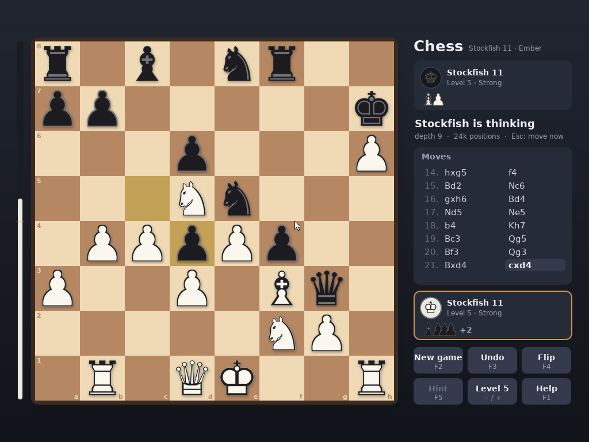

# Chess: Stockfish 11 as an N32

`CHESS.N32` is chess against [Stockfish 11](https://github.com/official-stockfish/Stockfish/tree/sf_11)
(January 2020), the last Stockfish whose evaluation is written by hand
rather than learned: no network file to load, and small enough to fit
Ember. It uses VESA graphics, the mouse and the keyboard. The tests show
that the engine searches, position for position and node for node, exactly
as the released Stockfish 11 does.



Stockfish is GPLv3, so `nano/chess/` is GPLv3 as well (`nano/chess/COPYING`).
As with Doom, the GPL source is not kept in the tree: `tools/build_chess.py`
downloads the release and checks it.

## Playing it

Build it (below), then type `CHESS`. The new game screen chooses:
- the opponent: Stockfish, two players, or watch Stockfish play itself;
- your colour;
- Stockfish's level.

| Control | What it does |
|---|---|
| Drag a piece, or click it and then its square | Move. The legal squares are marked; captures get a ring |
| Type `e2e4` | Move by coordinates. Backspace corrects, Esc clears |
| Arrows, then Enter or Space | A square cursor: pick up and put down |
| F1 | Help |
| F2 | New game |
| F3 | Undo. Against Stockfish, it takes back your move and its reply |
| F4 | Turn the board around |
| F5 | Hint: Stockfish's move for you, marked on the board |
| `+` and `-` | Stockfish's level |
| Esc or Space while Stockfish thinks | Make it move now |
| Esc | Leave (a game in progress is saved first) |

The command keys use no letters a–h and no digits 1–8, so they never
collide with typing a move.

| Argument | Effect |
|---|---|
| `WHITE`, `BLACK`, `RANDOM` | Your colour against Stockfish |
| `1` … `8`, or `LEVEL n` | The level |
| `2P` | Two players |
| `WATCH` | Stockfish plays both sides |
| `FEN <position>` | Start from a position |
| `EXIT` | Leave when the game ends |

A level is Stockfish's own *Skill Level* (0, 3, 6 … 20) and a time per move
(0.25 s at level 1 to 4 s at level 8). Below the top level, Stockfish now and
then plays a deliberately weaker move from among its best few.

All of chess is played, castling, en passant and promotion included. The game
ends at checkmate, stalemate, insufficient material, the fifty-move rule or
threefold repetition. The draws are applied automatically, as most chess
programs do. When a game ends, or you leave one, it is saved to `CHESS.PGN`.

## How it runs

**Stockfish's search, evaluation, move generation, hash table and endgame
knowledge are compiled unchanged.** What Ember cannot run is replaced, in
`nano/chess/port/`:

- **Threads** (`thread.cpp`). Stockfish parks search threads on condition
  variables. Ember has one core, so "start searching" simply searches, and
  returns when the search is done.
- **UCI** (`uci.cpp`). There is no standard input, so the game hands Stockfish
  its commands (`position`, `go`, `bench`) as strings. Stockfish's answers
  (`info ...`, `bestmove ...`) arrive line by line.
- **Streams** (`estd.h`). libc++'s streams sit on locales and a compiled library
  Ember does not have. The build rewrites the stream names Stockfish uses to a
  small replacement covering exactly what it does: reading a FEN, formatting
  numbers.
- **Tablebases** (`tbprobe.cpp`). There are none: a Syzygy set is gigabytes.
  Stockfish behaves this way anyway when it has no tablebase files.
- **Math** (`sflog.c`). Late-move reductions come from `log()` truncated to an
  integer, so `log` has to round as the reference does. It is the x87's
  `FYL2X`, as 32-bit C libraries do it; `exp` and `pow` are musl's, compiled
  in.
- **The C++ runtime** (`rt.cpp`). The code is compiled against libc++'s *headers*
  only, for 32-bit Linux, then linked against Ember's runtime. `rt.cpp`
  supplies what those headers expect from a library: `operator new`,
  `std::string`'s members, `__cxa_pure_virtual`, and running the global
  constructors. The build adds an `.init_array` to `nano/link.ld` for them.

The build applies its few textual patches to Stockfish's own files. Each
must match exactly, or the build stops.

The build also makes these choices:
- **No SSE, anywhere.** Ember does not turn SSE on, so the build is x87-only,
  and that includes the link step. Zig links its own compiler runtime (`exp`,
  64-bit conversions) and builds it for the CPU on the link line. The first
  build did not pass the flags there, and faulted with an invalid opcode.
- **An 8 MB stack.** The search can go 246 plies deep. `start.S` is copied
  with a bigger stack in its header.
- **The hash table fits the machine:** 16 MB, or 8 or 4 MB when memory is
  short. It runs in 64 MB.

The game itself is in `nano/chess/`:
- **`app.cpp`:** board, panels, dialogs, input and the game loop.
- **`game.cpp`:** the rules as a referee applies them: SAN, the draw rules,
  undo, PGN.
- **`gfx.cpp`:** antialiased shapes, text, pieces.
- **`platform_ember.cpp`:** the TSC clock (calibrated on the PIT), a VESA
  linear framebuffer (32, 24 or 16-bit colour; 1024x768 preferred), the
  desktop's `input.c`, files.

`tools/mkchessart.py` draws the pieces and fonts at build time from DejaVu
Sans, as antialiased masks. `CHESS.N32` is 2.2 MB, most of it artwork.

While Stockfish thinks, it calls the game back every 1024 nodes. The game
redraws the "thinking" line, keeps the pointer moving, and lets Esc stop the
search.

**Keyboard and mouse under Hyper-V.** In a Hyper-V VM, keyboard and mouse
input stops for good after one lost interrupt. The runtime reprograms both
8259s on each trip to real mode, and a byte that arrives meanwhile is never
announced. The keyboard controller then waits for it to be read before
sending anything more. `platform_ember.cpp` checks for such a byte whenever
it reads events, and hands it to the handler its interrupt would have reached.

## Building

```bash
python3 tools/build_chess.py --image
```

Needs Zig 0.13 and Python 3 with Pillow. `--image` also needs what `build.py`
needs. The first build downloads Stockfish 11 (1 MB) and the DejaVu fonts
(5 MB) to `build/src_dl`, checking both against their SHA-256.

## Testing

The checks live in [ember-contrib](https://github.com/borkit/ember-contrib/tree/main/chess#testing),
with a Linux build of the same code and the untouched Stockfish 11 to
compare against. Run in Docker, with QEMU for Ember:

| Check | Result |
|---|---|
| `bench` (47 positions to depth 13): the port and untouched Stockfish 11, both 32-bit x87 Linux builds, compared line by line (depth, score, best line, nodes) | Identical; 5,156,767 nodes, the release signature |
| `CHESS BENCH` on Ember, against the Linux run | Identical, all 714 lines |
| Perft: 11 standard positions, 478 million move sequences | 11 of 11 correct on Linux; 6 of 6 on Ember |
| 1,500 random games (190,303 positions). python-chess referees every position: FEN, the exact set of legal moves, SAN, the ending, and the PGN | All agree |
| The same program's first 25 games, run on Ember | Byte-identical to Linux |
| A disassembly of every function in `CHESS.N32` | No SSE instruction |
| 27 scripted games and screens in QEMU (see below) | All pass |
| Keys and mouse sent through Hyper-V's WMI interface | All arrive |

The scripted scenarios play by keyboard and mouse. Where a game ends or is
left, `CHESS.PGN` is read back off the disk and refereed. They cover:
- **Moving:** by dragging, by click-and-click, with the cursor, and by typing.
- **Special moves:** castling, en passant, promotion.
- **Endings:** checkmate, stalemate, threefold repetition, insufficient
  material, the fifty-move rule.
- **Screens:** hint, help, undo, flip, level and quit.
- **A full game:** Stockfish playing itself to the end.
- **Memory:** a game in 64 MB.

`CHESS BENCH`, `CHESS PERFT [DEEP]` and `CHESS RULES [games]` also run on
Ember itself and write `CHESSBEN.TXT`, `CHESSPER.TXT` and `CHESSRUL.TXT`,
so a real machine can be checked the same way.

It has not been run on real hardware yet: QEMU and Hyper-V only.
