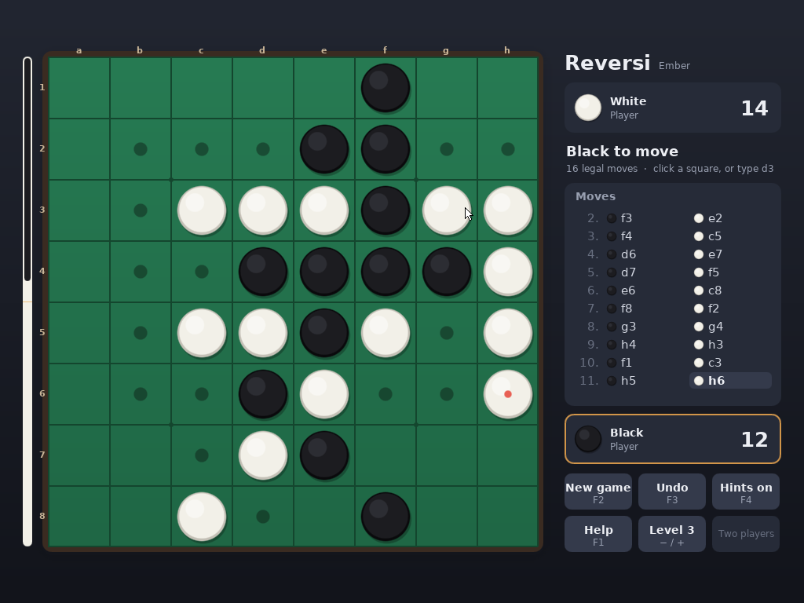

# Reversi: a browser game that became an N32

`REVERSI.N32` is Othello for Ember. It began as
[borkit/reversi](https://github.com/borkit/reversi), a browser game in one
`game.js` (checked against commit `87e6008`). Ember has no browser and no
JavaScript, so the game was split along the line that was already in the
file: the engine above `// ===== UI =====` was transcribed to C, and the
page below it was rebuilt as a native program with VESA graphics, mouse and
keyboard. The screen, input and C++ runtime code is the same as Chess's.



## Playing it

Build it (below), then type `REVERSI` at the prompt. A new game screen asks
for the opponent (the computer, a second player, or watch the computer play
itself), your colour, and the computer's level: 1 Beginner, 2 Easy,
3 Medium, 4 Hard, 5 Expert. Arrows and `Enter` work there too.

| Argument | Effect |
|---|---|
| `BLACK` or `B`, `WHITE` or `W` | Play that colour against the computer |
| `2P` | Two players at one keyboard and mouse |
| `WATCH` or `A` | The computer plays both sides |
| `1` to `5` | The computer's level, combined with the above: `REVERSI WHITE 4` |
| `EXIT` | Leave when the game ends (for scripted tests) |

Any argument skips the new game screen.

| Input | Effect |
|---|---|
| Click a square | Play there. With hints on, legal squares are dotted and a faint disc shows under the pointer |
| Type a square, e.g. `d3` | Play there |
| Arrows, then `Enter` or `Space` | Move a highlighted cursor and play |
| `F1` | Help |
| `F2` or `N` | New game screen |
| `F3` or `U` | Undo. Against the computer it also takes back the computer's reply |
| `F4` or `S` | Hints on or off |
| `+` / `-`, or `L` | Computer's level |
| `Esc` or `Q` | Leave, after a confirmation (`Enter`/`Y` or `Esc`/`N`) |

`N`, `U`, `S`, `L` and `Q` are the first version's keys, kept; none of them
is a board letter, so typing squares never collides with a command.

The board is on the left, with a bar beside it showing Black's share of the
discs. The panel on the right has a card per player (disc count, level),
whose move it is and how many legal moves there are, the move log, and the
buttons. Each capture is animated: the new disc drops in and the captured
ones turn over. A side with no legal move passes automatically; the panel
says so and the log shows it. When neither side can move, a dialog gives the
score, and the game is written to `REVERSI.TXT`:

```
Reversi on Ember
Black: computer
White: computer
Level: 2
Moves: B:d3 W:e3 B:f3 ... B:g7 W:pass B:g1
Score: 46-18
Result: Black wins
```

## How it runs

The shell finds `REVERSI` by trying `.COM`, `.EXE`, `.BAT` and then `.N32`.
`pm32.asm` reads the 32-byte NX32 header, copies the image above 1 MB and
enters it in flat 32-bit protected mode. The header for this build:

| Field | Value |
|---|---|
| load | `0x110000` |
| entry | `0x110020` |
| data end | `0x14FCE0` (261,344 bytes of file) |
| bss end | `0x1507F0` (2,832 bytes of bss; the back buffer is allocated) |
| stack | 1 MB (`start.S` is copied and its stack field raised) |

Most of the file is the text, drawn at build time. At start-up the program:

1. **Runs its global constructors** from the `.init_array` the build adds to
   `nano/link.ld`.
2. **Sets the x87 to 53-bit precision.** Scores are `double`, as in
   JavaScript; the x87 would otherwise keep 80-bit intermediates and round
   differently from the browser.
3. **Opens the screen:** a VESA linear framebuffer through `sys_vbe_info`,
   `sys_vbe_mode` and `sys_set_vbe_mode`, preferring 1024x768 in 32-bit
   colour; 24 and 16-bit colour work too, and it needs at least 640x480.
   Every frame is drawn into a 32-bit back buffer and copied out, converted
   to the mode's pixel format. When only the mouse moved, only the pointer's
   rectangles are copied.
4. **Starts input** with `nano/gui/input.c` and `touch.c`, the desktop's
   drivers: keyboard events with scancodes and characters, and the PS/2
   mouse.

The computer's move runs inline, between frames. Its reply is held back
until at least 450 ms have passed, so it can be followed. On exit the
program restores text mode and prints `Thanks for playing Reversi.`

### The files

| File | What it is |
|---|---|
| `nano/reversi/engine.c`, `engine.h` | Rules and computer player (below). No Ember dependency |
| `nano/reversi/app.cpp` | The game: board, panel, dialogs, input, animation, `REVERSI.TXT` |
| `nano/reversi/gfx.cpp`, `gfx.h` | Antialiased circles, rounded rectangles, shadows, gradients, and text from pre-drawn fonts |
| `nano/reversi/platform.h`, `platform_ember.cpp` | Clock (RDTSC calibrated against the PIT), VESA screen, events, files, command line |
| `nano/reversi/rt.cpp` | The C++ runtime Ember lacks: `operator new`/`delete`, `__cxa_*`, global constructors, `std::string`'s members |
| `tools/mkreversiart.py` | Draws the DejaVu Sans fonts into `build/reversi/gen/assets.h` as alpha masks |
| `tools/build_reversi.py` | The build |

`gfx`, `platform` and `rt` are the same files as in Chess (#2), copied so
each game builds on its own. If both are merged, they could move to a shared
folder.

### Keyboard and mouse under Hyper-V

In a Hyper-V Generation 1 VM, keyboard and mouse input can stop for good
after one lost interrupt: the runtime reprograms both 8259s on every trip to
real mode, a byte arriving meanwhile is never announced, and the 8042 sends
nothing more until it is read. The first version of this game read keys with
`sys_getkey()` and went deaf that way. `platform_ember.cpp` checks the
controller's status whenever it reads events and calls the handler the lost
interrupt would have reached, so this version keeps working. The desktop has
the same problem; I have a fix for `input.c` and can send it separately.

## The engine

`nano/reversi/engine.c` follows `game.js` function for function:

- **`flips_for`, `legal_moves`, `apply_move`**: the eight-direction scan,
  on a flat 64-cell board.
- **`evaluate`**: the same 8x8 positional weights (corners 120, the
  X-squares -40), mobility weighted early and disc difference weighted late,
  blended by the same endgame factor.
- **`minimax`**: alpha-beta, with moves sorted by positional weight so
  corners are searched first. A side with no move passes into the next ply.
  A finished game scores ±10,000 per disc.
- **`choose_ai_move`**: at level 1, a random pick from the four
  best-weighted moves (seeded from the clock, so games differ). At levels
  2-5, a search that many plies deep.

With `-DREVERSI_NATIVE`, `engine.c` and `engine.h` compile against a host
libc, which is how they were checked against the original.

### Checked against game.js

A small harness drives both engines through the same 60 games. A shared
xorshift32 picks random moves, and on some turns asks the computer instead.
At every position it prints the board, each legal move with its flip count,
and the computer's choice at depth 3, plus the final score of each game.

The C and JavaScript outputs are **byte-identical: 3,598 positions and 60
results, 3,658 lines**. The engine is unchanged by the new front end, so
this still holds. The harness needs `game.js`, so it lives outside this
tree:
[parity.c](https://github.com/borkit/ember-contrib/blob/main/reversi/parity.c) ·
[parity.mjs](https://github.com/borkit/ember-contrib/blob/main/reversi/parity.mjs).

## Building

```bash
python3 tools/build_reversi.py            # root/REVERSI.N32
python3 tools/build_reversi.py --image    # and build/ember.img with it
```

It needs Zig 0.13 and Python 3 with Pillow, and takes `find_zig()` and
`finish_image()` from `build_doom.py`, so it looks for Zig the same way. It:

1. Downloads the DejaVu fonts 2.37 to `build/src_dl` (or
   `$REVERSI_DOWNLOADS`), checks their SHA-256, and draws the text sizes the
   game uses into `build/reversi/gen/assets.h`.
2. Compiles the C++ with `zig c++ -target x86-linux-musl -std=c++11 -O2
   -fno-exceptions -fno-rtti -fno-threadsafe-statics`. The Linux target is
   only for libc++'s and the C library's headers; nothing from either
   library is linked, and the calls land in Ember's runtime and `rt.cpp`.
3. Compiles `engine.c`, a copy of `nano/start.S` with a 1 MB stack, `sys.c`,
   `libc.c`, `gui/input.c` and `gui/touch.c` with `zig cc -target
   x86-freestanding -ffreestanding -fno-builtin -nostdinc`.
4. Links with `nano/link.ld` plus an `.init_array` section, `start.o`
   first, and `-z norelro`.
5. Runs `zig objcopy -O binary`, then `finish_image()`, which pads the file
   back to the size the header declares.
6. With `--image`, runs `build.py`, which copies everything in `root/` onto
   the disk.

Everything, including the link, uses `-march=i686 -mno-sse -mno-sse2
-mno-mmx -fno-pic -fno-pie`. Ember does not enable SSE, and Zig builds its
own compiler runtime for the CPU named on the link line: without the flags
there, that runtime would use SSE and fault.

`build.py` does not run this script, just as it does not run
`build_doom.py`, so the image still builds without Zig or a network
connection. `root/*.N32` is already in `.gitignore`.

## Testing

Everything below ran on Ember `main` at `2c07764` in a container (Ubuntu
24.04, Zig 0.13.0, NASM 2.16.01, QEMU 8.2.2, Python 3.12):
[ember-contrib/docker](https://github.com/borkit/ember-contrib/tree/main/docker).
The scripts are in
[ember-contrib/reversi/tests](https://github.com/borkit/ember-contrib/tree/main/reversi/tests).

| Check | Result |
|---|---|
| Engine parity with `game.js`, 60 games | Byte-identical, 3,658 lines |
| Disassembly of every function in `REVERSI.N32` | No SSE instruction |
| Scripted games in QEMU, below | All pass |
| `TYPE README.TXT` | The REVERSI entry is shown |
| Keys and mouse sent through Hyper-V's WMI interface to a Generation 1 VM (the ember-contrib build of the same code) | A typed move is played and the computer replies; the pointer moves |

Each scripted scenario boots `build/ember.img` fresh with
`tools/qemu_test.py`, types keys and moves and clicks the mouse, then reads
the discs back off the screenshot, or reads `REVERSI.TXT` off the disk and
referees it with rules written separately from `engine.c` (every move legal
for the side that made it, passes only with no move, turns alternating, the
game over exactly when neither side can move, score and result right).

| Scenario | Input | Checked |
|---|---|---|
| New game screen | `reversi` | Shown |
| Choosing with keys | Right, Right, Down, Down, Left, Enter | Watch at level 2 starts and plays |
| Typed move | `reversi black 3`, `d3` | Black on d3, computer replied: 6 discs |
| Play white | `reversi white` | Computer opened: 4 black, 1 white |
| Mouse | `reversi 2p`, click c4 | Black on c4 and d4 |
| Cursor | `reversi 2p`, Enter, Enter, Right, Enter | Black d3, then White e3 |
| Illegal moves | `a1`, `d6` | Refused; board unchanged |
| Undo | `d3`, `c5`, F3, `U` | Back to the opening |
| Undo against the computer | `reversi black 1`, `d3`, F3 | Back to the opening |
| Hints and level | F4, `S`, `+`, `+`, `-`, `L` | No fault |
| Help | F1 | Shown |
| Quit | Esc, Enter; and `Q`, `Y` | `Thanks for playing Reversi.` |
| A whole game typed in | `reversi 2p exit`, 60 moves | White's pass is automatic; `REVERSI.TXT` has exactly the typed moves and the pass; referee: all legal, 46-18 |
| A whole game, computer vs computer | `reversi watch 2 exit` | Referee: all legal |
| 64 MB of memory | `reversi black 3`, `d3` | Computer replied |

The first version of this PR was a VGA mode 13h front end. It passed the same
kind of tests in QEMU but stopped responding to the keyboard in Hyper-V (the
lost interrupt above), which is why it was rewritten on Chess's input code.

It has not yet been run on real hardware. It needs a VESA BIOS with a
linear-framebuffer mode of at least 640x480, which a BIOS or CSM boot
provides.
